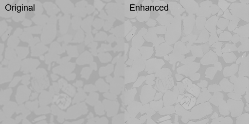

# 🪨 Enhancing Sandstone Tomograms with ResShift (Diffusion-based Super-Resolution)

This repo documents how I applied the [ResShift](https://github.com/zsyOAOA/ResShift) diffusion model to enhance 2D slices extracted from a 3D `.nc` tomogram of Bentheimer sandstone.

---

## 🗂️ What I Was Given

- A 3D sandstone dataset in **NetCDF (`.nc`) format**
- It contained raw grayscale tomography data (800×800×400 voxels)
- The task was to **run a diffusion model on 2D slices** and demonstrate super-resolution results

---

## 🛠️ What I Did

- Extracted 2D slices from the `.nc` file using `xarray`
- Downscaled them to 128×128 (to avoid GPU memory issues)
- Ran **ResShift** for 4× super-resolution on each slice
- Created:
  - 📸 Side-by-side image comparisons
  - 🎞️ A scroll-through animation
  - 📊 Quality metrics using PSNR & SSIM

---

## 🚀 Getting Started

To reproduce or extend this:

See [`README_setup.md`](./README_setup.md) for full instructions on:

- Setting up the environment
- Running ResShift
- Generating comparisons
- Evaluating results

## 📁 Files and Folders

```
.
├── slices_small/         # Downscaled input slices for inference (128 x 128)
├── results/              # Outputs from ResShift
├── comparison_grid/      # Side-by-side input vs output images
├── comparison.gif        # Animation of results
├── save_slices.py        # Converts .nc file to 2D PNG slices
├── reduce_size.py        # Resizes slices before super-resolution
├── visual_compare.py     # Creates comparison image grids
├── eval_metrics.py       # Computes PSNR / SSIM scores
├── requirements.txt      # Python environment dependencies
├── README.md             # ← You're here
├── README_setup.md       # Setup & run instructions
```

## 🔬 Results Snapshot

### 📸 Scroll-through Comparison (click to open)



### 🖼️ Sample Side-by-Side Grids

(See [comparison_grid/](./comparison_grid) for full list)

| Input → Output  |
| --------------- |
| `slice_050.png` |
| `slice_150.png` |
| `slice_250.png` |

---

## 📈 Quantitative Results

| Metric           | Value      |
| ---------------- | ---------- |
| **Average PSNR** | `38.21 dB` |
| **Average SSIM** | `0.987`    |

These results indicate a high-quality enhancement in structure and visual clarity across slices.

---
