# 🖼️ Results: Sandstone Slice Super-Resolution (ResShift)

Below are sample comparisons of original input slices and their AI-enhanced (ResShift) outputs.

---

## 🔬 Visual Comparisons

| Original Slice                                      | Enhanced (ResShift)                            |
| --------------------------------------------------- | ---------------------------------------------- |
|  | 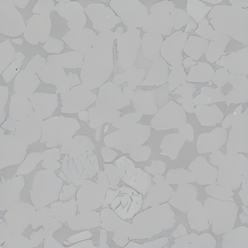 |
| 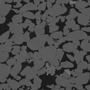 | 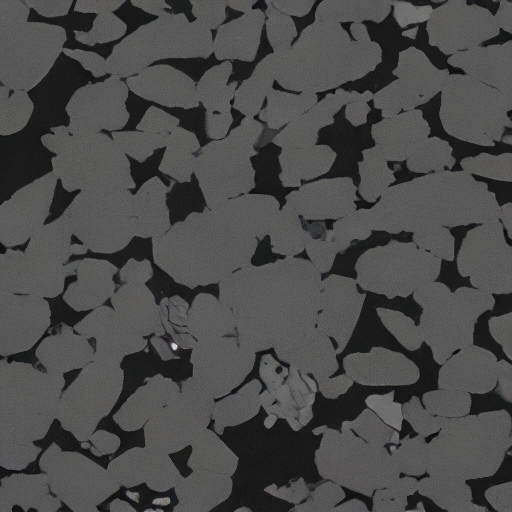 |
| 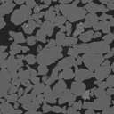 | 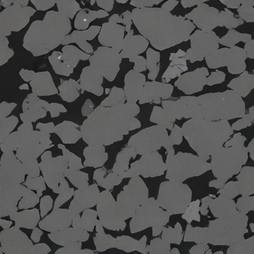 |
| 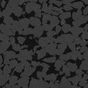 | 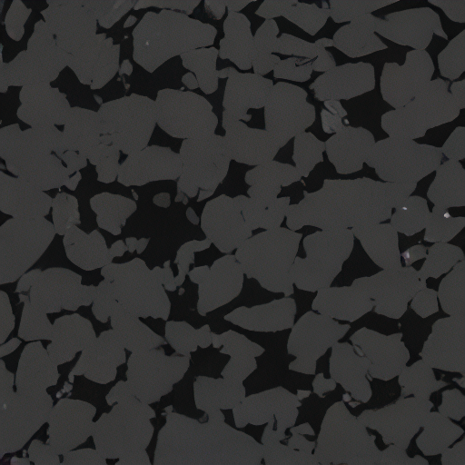 |
| 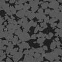 | 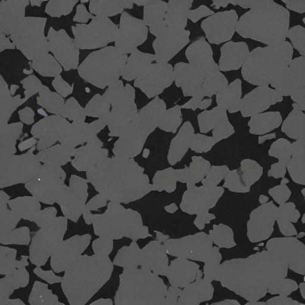 |
| 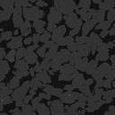 | 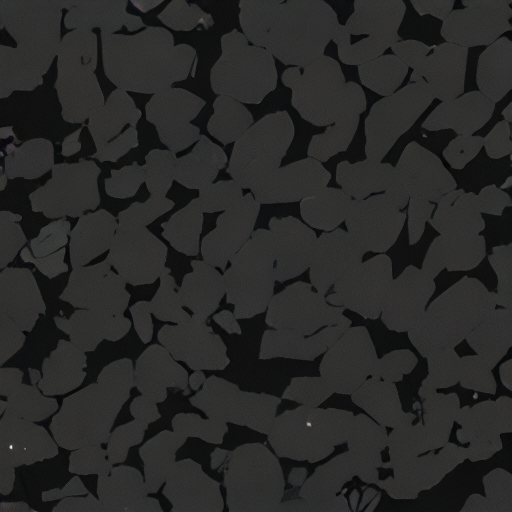 |
| 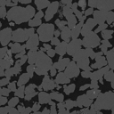 | 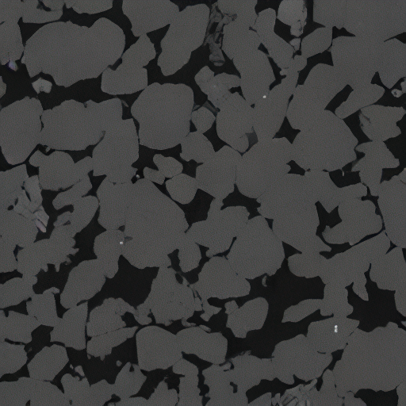 |
|  | 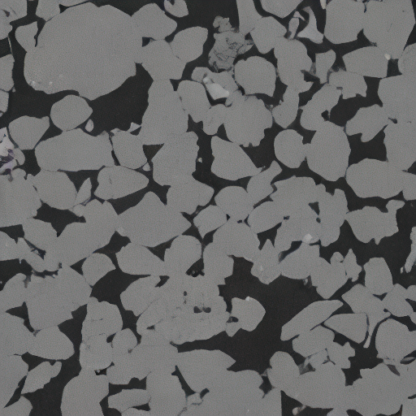 |

---

## 📊 Quantitative Results

| Slice Name    | PSNR (dB) | SSIM  |
| ------------- | --------- | ----- |
| slice_000.png | 33.06     | 0.987 |
| slice_050.png | 39.62     | 0.987 |
| slice_100.png | 38.87     | 0.988 |
| slice_150.png | 39.38     | 0.986 |
| slice_200.png | 39.65     | 0.988 |
| slice_250.png | 39.45     | 0.988 |
| slice_300.png | 38.85     | 0.987 |
| slice_350.png | 36.81     | 0.988 |

### 📈 Overall Average

- **PSNR:** 38.21 dB
- **SSIM:** 0.987

> These results show strong structural preservation and sharpness recovery across all slices.

---
